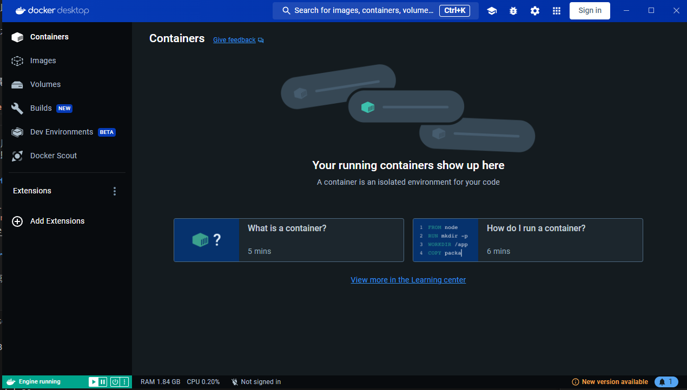

# Docker + PyTorch (>= 2.x) + CUDA (11.7/11.8) 環境建置教學

**目標:** 建立一個 Docker 容器，其中已安裝：

*   Docker 環境 (已安裝 Docker Desktop)
*   Python 環境
*   PyTorch (2.x 版本以上，例如 2.0 或更新版本)
*   CUDA Toolkit (11.7 或 11.8 版本)
*   cuDNN (與 CUDA 版本相容)

## 步驟 1: 前置準備

在開始之前，請確保你的電腦已安裝以下軟體：

1.  **Download [Docker Desktop](https://www.docker.com/products/docker-desktop/)**  
2.  **[NVIDIA 驅動程式](https://www.nvidia.com/Download/index.aspx) (如果你需要 GPU 支援):**  如果你的電腦有 NVIDIA 顯示卡，並且你希望在 Docker 容器中使用 GPU 加速，請確保已安裝最新版本的 NVIDIA 驅動程式。  你可以從 NVIDIA 官方網站下載驅動程式。  
3.  **確認 NVIDIA Container Toolkit (如果你需要 GPU 支援，Linux 系統):**  對於 Linux 系統，你需要安裝 `nvidia-container-toolkit` 才能在 Docker 容器中使用 GPU。  Docker Desktop for Windows 和 macOS 通常已預裝相關組件。  Linux 系統安裝指南請參考： [NVIDIA Container Toolkit 安裝指南](https://docs.nvidia.com/datacenter/cloud-native/container-toolkit/install-guide.html)

## 步驟 2: 驗證 Docker 安裝

### 2.1 確認安裝
輸入
``` bash
docker --version
```
結果
``` bash
Docker version 25.0.2, build 29cf629
```
### 2.2 驗證Docker是否正常運行
輸入
``` bash
docker run hello-world
```
結果，看見Hello from Docker，執行成功!
``` bash
Unable to find image 'hello-world:latest' locally
latest: Pulling from library/hello-world
e6590344b1a5: Pull complete
Digest: sha256:e0b569a5163a5e6be84e210a2587e7d447e08f87a0e90798363fa44a0464a1e8
Status: Downloaded newer image for hello-world:latest

Hello from Docker!
```

## 步驟 3: 建立Docker file
為了組織你的 Dockerfile 和相關檔案，我們建議建立一個專案目錄。

``` bash
mkdir Docker
cd Docker
```

現在可以在Docker資料夾中進行Docker file的配置。
Dockerfile 是一個文字檔案，其中包含了建立 Docker 鏡像的指令。

1. **建立一個名為 Dockerfile 的新檔案 (注意：沒有副檔名)**

    ``` bash
    cd .> Dockerfile
    ```
2. **開啟 Dockerfile 並貼上以下內容**
    ``` Dockerfile
        FROM nvidia/cuda:11.8.0-cudnn8-devel-ubuntu22.04

        # 設定工作目錄
        WORKDIR /app

        # 安裝 Python 3.10 (或其他你需要的 Python 版本)
        RUN apt-get update && apt-get install -y python3.10 python3-pip

        # 設定 Python 3.10 為預設 Python 版本
        RUN ln -sf /usr/bin/python3.10 /usr/bin/python && \
            ln -sf /usr/bin/pip3 /usr/bin/pip

        # 安裝 PyTorch (與 CUDA 11.8 相容的版本)
        RUN pip install torch torchvision torchaudio --index-url https://download.pytorch.org/whl/cu118

        # (可選) 安裝其他你需要的 Python 套件
        # 例如: RUN pip install numpy pandas ...

        # 你的程式碼可以 COPY 到容器中 (稍後步驟會說明)
        # COPY . .

        # 設定容器啟動時執行的命令 (可選，根據你的需求)
        # CMD ["python", "your_script.py"]
    ```
    <details>
    <summary>Dockerfile 解說:</summary>

    *   **`FROM nvidia/cuda:11.8.0-cudnn8-devel-ubuntu22.04`**:
        *   指定基礎鏡像。 我們使用 NVIDIA 官方提供的 CUDA 鏡像，版本為 CUDA 11.8.0、cuDNN 8，基於 Ubuntu 22.04。
        *   `nvidia/cuda` 是 NVIDIA 在 Docker Hub 上提供的官方 CUDA 鏡像倉庫。
        *   `11.8.0-cudnn8-devel-ubuntu22.04` 是鏡像標籤，指定了 CUDA 版本、cuDNN 版本和基礎作業系統。  你可以根據你的需求選擇 CUDA 11.7 的版本 (例如 `nvidia/cuda:11.7.1-cudnn8-devel-ubuntu22.04`)。  請參考 [NVIDIA CUDA Docker Hub](https://hub.docker.com/r/nvidia/cuda) 尋找其他版本。
        *   `devel` 版本包含了編譯 CUDA 程式所需的工具，適合開發環境。

    *   **`WORKDIR /app`**:
        *   設定容器內的工作目錄為 `/app`。  後續的 `RUN`, `COPY`, `CMD` 等指令都會在這個目錄下執行。

    *   **`RUN apt-get update && apt-get install -y python3.10 python3-pip`**:
        *   使用 `apt-get` 套件管理器更新套件列表並安裝 Python 3.10 和 `pip` (Python 的套件管理工具)。
        *   你可以根據需要更改 Python 版本 (例如 `python3.9`, `python3.11` 等)。

    *   **`RUN ln -sf /usr/bin/python3.10 /usr/bin/python && ln -sf /usr/bin/pip3 /usr/bin/pip`**:
        *   建立符號連結，將 `python3.10` 和 `pip3` 連結到 `python` 和 `pip`。 這樣在容器中可以直接使用 `python` 和 `pip` 命令，而不需要指定版本號。
        *   -sf 強制覆蓋連結，若執行-s時，已經存在連結則會報錯

    *   **`RUN pip install torch torchvision torchaudio --index-url https://download.pytorch.org/whl/cu118`**:
        *   使用 `pip` 安裝 PyTorch, torchvision, torchaudio。
        *   `--index-url https://download.pytorch.org/whl/cu118` 指定 PyTorch 的 wheels 索引網址，確保下載與 CUDA 11.8 相容的版本。  如果你使用 CUDA 11.7，請將 `cu118` 改為 `cu117`。 你可以在 [PyTorch 官網](https://pytorch.org/get-started/locally/) 找到對應 CUDA 版本的安裝指令。

    *   **`# (可選) 安裝其他你需要的 Python 套件`**:
        *   你可以根據你的專案需求，使用 `RUN pip install 套件名稱` 的格式，在 Dockerfile 中安裝其他需要的 Python 套件，例如 `numpy`, `pandas`, `transformers` 等。

    *   **`# COPY . .`**:
        *   這行被註解掉了，但它是一個重要的指令。  `COPY . .` 的意思是將目前目錄 (建置 Docker 鏡像時的上下文，也就是 `pytorch-cuda-docker` 目錄) 的所有檔案複製到容器的 `/app` 工作目錄中。  我們會在後續步驟中啟用這行，將你的程式碼複製到容器內。

    *   **`# CMD ["python", "your_script.py"]`**:
        *   這行也被註解掉了，但它設定了容器啟動時預設執行的命令。  `CMD ["python", "your_script.py"]` 的意思是當容器啟動時，會執行 `python your_script.py` 命令。  你需要將 `your_script.py` 替換成你的 Python 腳本名稱。  我們會在後續步驟中根據需求設定 `CMD` 指令。

## 步驟4. 建置Docker鏡像
現在我們已經有了 Dockerfile，接下來要使用它來建置 Docker 鏡像。
鏡像是一個輕量級、獨立的可執行軟體包，包含了運行應用程式所需的一切：程式碼、執行環境、系統工具、函式庫等等。

1. **執行 Docker 建置命令。**
    ``` bash
    docker build -t pytorch-cuda:latest .
    ```
    <details>
    <summary>build指令解釋</summary>

        docker build: 這是 Docker 的建置鏡像命令。

        -t pytorch-cuda:latest: 這個選項用於為鏡像指定標籤 (tag)。

        pytorch-cuda 是你為鏡像取的名稱。你可以根據你的喜好命名。

        latest 是標籤名稱。latest 是一個常用的標籤，通常指向鏡像的最新版本。 使用標籤可以方便地管理和識別不同的鏡像版本。

        冒號 : 分隔鏡像名稱和標籤。

        .: 最後一個 . 代表建置上下文 (build context) 是目前目錄。Docker 在建置鏡像時，會將目前目錄下的所有檔案和目錄作為建置上下文傳送給 Docker Daemon。 Dockerfile 中的 COPY 和 ADD 指令會以這個上下文為基準來尋找檔案。

    你可能會遇到下列錯誤，這表示你必須先將docker desktop開啟，直接到windows搜尋欄找尋並且開啟
    ``` bash
    ERROR: error during connect: this error may indicate that the docker daemon is not running: Get "http://%2F%2F.%2Fpipe%2Fdocker_engine/_ping": open //./pipe/docker_engine: The system cannot find the file specified
    ```
2. 成功執行docker build，你會看到
    ``` bash
    [+] Building 204.2s (10/10) FINISHED
    ...
    ...

    ```
3. 查看本地Docker鏡像
    ``` bash
    docker images
    ```
    
    ``` bash
    REPOSITORY     TAG       IMAGE ID       CREATED         SIZE
    pytorch-cuda   latest    4f2af929a58f   6 minutes ago   15.3GB
    hello-world    latest    74cc54e27dc4   3 weeks ago     10.1kB
    python         3.8       2cc8a79ea641   14 months ago   998MB
    ```

## 步驟5. 運行Docker鏡像建立容器
在這裡我們會用步驟4. 的鏡像來建立容器

容器建立完成環境的架設就基本完成

1. 使用image建立Docker container
    ``` bash
    docker run --gpus all --shm-size=16g -v C:\Users\nckubot65904\Desktop\Coding\Lung_Nodule_Detection_Mamba_Backbone\Docker\app:/app -it --name MambaLungDetect pytorch-cuda:latest bash
    ```
    <details>
    <summary>解釋</summary>

    `docker run`: 這是 Docker 的運行容器命令。

    `--gpus all`: 讓容器可以使用主機上的所有 NVIDIA GPU。

    `--shm-size=8g`: 配置容器的shared memory 大小
    `-v`: 將主機上的目錄掛載到容器內的指定路徑
    - `-it`: 這是兩個選項的組合：
        - `-i` 或 --interactive: 保持標準輸入 (STDIN) 開啟，即使沒有連接。 這允許你與容器互動。

        - `-t` 或 --tty: 分配一個偽終端 (pseudo-TTY)。 這讓你可以像在終端機中一樣與容器互動。

    `--name pytorch-container`: 為容器指定名稱為 pytorch-container。 

    `pytorch-cuda:latest`: 指定要使用的鏡像名稱和標籤

    `/bin/bash`: 指定容器啟動後要執行的命令。 /bin/bash 會啟動一個 Bash shell，讓你進入容器的互動式終端機。
    </details>
    docker run成功執行的話，終端機的提示符號會改變: `root@8face5ffd6e0:/app#`

2. 若欲進入已存在的container
    * 列出 Container： `docker container ls -a` (假設你看到 pytorch-container 在列表中，狀態可能是 Exited)

    * 啟動 Container： `docker start "CONTAINER NAME" `

    * 進入 Container： `docker exec -it "CONTAINER NAME" /bin/bash`

## 步驟6. 複製程式碼到容器且執行程式

1. 將你的程式碼複製到與Dockerfile同目錄下
2. 取消Dockerfie中的COPY註解
    ``` bash
    COPY . . # 將目前目錄的所有檔案複製到容器的 /app 工作目錄
    CMD ["python", "your_script.py"] # 設定容器啟動時預設執行 python my_script.py

    # CMD ["python", "your_script.py"] == 在CMD執行python your_script.py
    ```

## Debug
<details>
    <summary>Unexpected error from cudaGetDeviceCount()</summary>

    # Problem discript:

    UserWarning: CUDA initialization: Unexpected error from cudaGetDeviceCount(). 
    Did you run some cuda functions before calling NumCudaDevices() that might have already set an error?
    Error 500: named symbol not found (Triggered internally at ../c10/cuda/CUDAFunctions.cpp:109.)return torch._C._cuda_getDeviceCount() > 0

    # Solution: 
    
    just update your docker desktop to the latest version
</details>